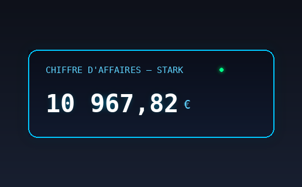

# Chiffre d'affaires — Stark (widget Übersicht)

Un widget [Übersicht](http://tracesof.net/uebersicht/) qui affiche un compteur de
chiffre d'affaires augmentant en temps réel, dans un style HUD bleu lumineux.

## Installation

1. Installe [Übersicht](http://tracesof.net/uebersicht/)
2. Télécharge `chiffre-affaires-stark.widget.zip` et décompresse-le
3. Place le dossier `chiffre-affaires-stark.widget` dans
   `~/Library/Application Support/Übersicht/widgets/`
4. Übersicht affiche le widget automatiquement

## Configuration

Tout se règle en haut de `index.jsx` :

- `START_VALUE` — valeur de départ en euros
- `RATE_PER_SECOND` — vitesse d'augmentation (€/seconde)
- `RESET_AT_MIDNIGHT` — `true` pour repartir de `START_VALUE` chaque jour à minuit,
  `false` pour continuer d'augmenter sans jamais redescendre
- `POSITION` — position du widget sur l'écran (CSS `top`/`right`/`bottom`/`left`)
